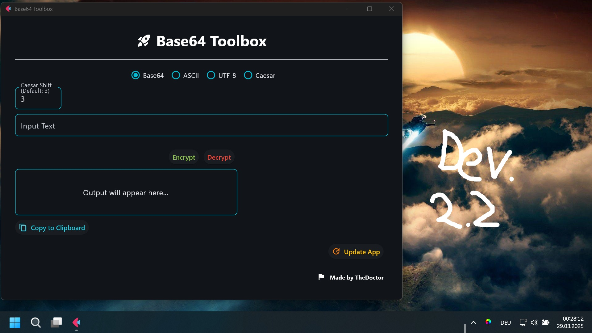

# Base64Tools
## Overview



**Base64Tools** is a powerful and easy-to-use tool designed to be fancy. 
It is designed to encode and decode texts in both Asci and UTF-8.

## Features
Auto App Update, a nice modern design, encryption / decryption of massages


## Installation
> [!NOTE]
>**Installer** / **standalone Versions** can be found here: 
>https://github.com/TheDoctor200/Base64Tools/releases/latest

<br>

>**Web Version:** https://base64tools.onrender.com
>(currently TBD)

### Github Cloning:
1. You need the latest version of python installed: https://www.python.org/downloads/
2. Install my Tool using pip as always, make sure to open the terminal in the directory you cloned the app:

### Requirenment Installation:
```bash
pip install -r requirements.txt
```
### Run the app:
```bash
python frontend_app.py
```
## Support me, my hard work and future development:
Crypto Wallet Adress: 0xfbe3E2337e7bCfC9245f0C2eAeF16597f0Bb2Dc2 (ETH, LTC, BNB)
